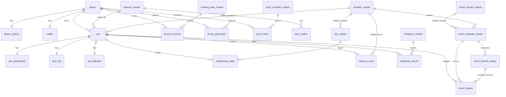

# Little Paw Town - DB Draft v0.1

---

## 1. 문서 목적

본 문서는 `Little Paw Town GDD v0.1` 및 `Data Draft v0.1`을 기준으로, MVP 구현에 필요한 **관계형 DB 스키마 초안**을 정리한 문서다.

목표는 다음과 같다.
- 서버/클라이언트 저장 기준이 되는 **테이블 구조**를 정의한다.
- 마스터 데이터와 유저 상태 데이터를 분리한다.
- **반려동물 종 확장**, **애정도 시스템**, **이벤트 분기 구조**를 DB 레벨에서 수용한다.
- MVP에서 바로 구현 가능한 수준으로 **PK / FK / UNIQUE / INDEX / 제약 방향**을 제안한다.

본 문서는 최종 DDL 확정본이 아니라, **개발 착수용 DB 설계 초안**이다.

---

## 2. 전제 및 설계 기준

### 2.1 대상 범위
본 초안은 다음 MVP 범위를 대상으로 한다.
- 플레이어 계정/설정
- 반려동물 1마리 운용 기준 구조
- 반려동물 생성/외형/특성
- 애정도
- NPC 관계
- 이벤트 템플릿/분기/보상/이력
- 추억 카드
- 하우징 인벤토리/배치
- 재화
- 미니게임 기록
- 푸시/돌발 이벤트 상태

### 2.2 DB 가정
- 관계형 DB 기준 작성
- `MySQL 8+` 또는 이에 준하는 RDBMS 가정
- 모든 시각은 기본적으로 `UTC` 저장, 표시는 유저 타임존 사용
- 서버 authoritative 구조를 우선 가정
- `ENUM`은 DB 고정 enum보다 **문자열 코드 + 애플리케이션 검증**을 권장

### 2.3 핵심 설계 원칙
- **마스터 테이블**과 **유저 상태 테이블**을 분리한다.
- 애정도와 NPC 친밀도는 분리한다.
- 이벤트는 단일 테이블이 아니라 **템플릿 / 분기 / 보상 / 이력**으로 나눈다.
- MVP에서는 `player : pet = 1 : N` 구조를 유지하되, 실제 운용은 1마리만 허용한다.
- 종 확장을 위해 대부분의 콘텐츠 테이블에 `species_id` 또는 `species_scope` 개념을 둔다.
- 과도한 일반화보다는 **제작/운영 편의성**을 우선한다.

---

## 3. 공통 규칙

### 3.1 네이밍
- 테이블: `snake_case`
- PK: `{table}_id` 또는 도메인 기준 ID
- FK: 참조 대상 테이블의 PK명과 동일
- 코드성 마스터 ID: `VARCHAR(50)` 내외 권장
- 유저 상태 ID: `CHAR(26)` ULID 또는 `BIGINT UNSIGNED` 중 하나로 통일 권장

> 본 문서는 예시상 **ULID/문자열 ID 혼합 구조**로 작성한다.  
> - 운영/상태 테이블 PK: `CHAR(26)`  
> - 마스터 코드 PK: `VARCHAR(50)`

### 3.2 공통 컬럼
대부분의 상태 테이블에 아래 컬럼을 권장한다.

| 컬럼 | 타입 | 설명 |
|---|---|---|
| created_at | DATETIME(3) | 생성 시각 |
| updated_at | DATETIME(3) | 수정 시각 |

로그성 테이블은 필요 시 `updated_at` 없이 `created_at` 또는 발생 시각만 둔다.

### 3.3 JSON 사용 원칙
JSON은 아래처럼 제한적으로 사용한다.
- 팔레트 값
- 스냅샷 결과
- 가변 보상 묶음
- 운영용 확장 메타

정규 관계가 명확한 데이터는 JSON 대신 별도 컬럼 또는 별도 테이블을 사용한다.

---

## 4. 테이블 구성 개요

## 4.1 마스터 테이블
- `species_master`
- `part_master`
- `trait_master`
- `location_master`
- `npc_master`
- `event_template_master`
- `event_branch_master`
- `event_reward_master`
- `dialogue_text_master`
- `affection_level_master`
- `housing_item_master`
- `minigame_master`
- `push_scenario_master`

### 4.2 유저/상태 테이블
- `player`
- `player_setting`
- `wallet`
- `pet`
- `pet_appearance`
- `pet_trait`
- `pet_affection`
- `relationship_state`
- `event_history`
- `memory_card`
- `home_inventory`
- `home_placement`
- `minigame_record`
- `push_inbox`

---

## 5. ERD 요약

---

## 6. 마스터 테이블 상세

## 6.1 `species_master`
반려동물 종 정의.

| 컬럼 | 타입 | 제약 | 설명 |
|---|---|---|---|
| species_id | VARCHAR(50) | PK | 예: `dog`, `cat` |
| name_ko | VARCHAR(100) | NOT NULL | 종 명 |
| enabled | TINYINT(1) | NOT NULL DEFAULT 1 | 사용 여부 |
| body_type_key | VARCHAR(50) | NULL | 기본 체형 키 |
| animation_set_id | VARCHAR(100) | NULL | 기본 애니메이션 세트 |
| ui_icon_key | VARCHAR(100) | NULL | UI 아이콘 |
| default_voice_set | VARCHAR(100) | NULL | 기본 보이스 세트 |
| display_order | INT | NOT NULL DEFAULT 0 | 노출 순서 |
| created_at | DATETIME(3) | NOT NULL | 생성 시각 |
| updated_at | DATETIME(3) | NOT NULL | 수정 시각 |

**Index**
- `idx_species_master_enabled (enabled, display_order)`

---

## 6.2 `part_master`
종별 외형 파츠 정의.

| 컬럼 | 타입 | 제약 | 설명 |
|---|---|---|---|
| part_id | VARCHAR(50) | PK | 파츠 ID |
| species_id | VARCHAR(50) | FK | 대상 종 |
| part_category | VARCHAR(30) | NOT NULL | `ear`, `eye`, `tail`, `pattern`, `accessory` 등 |
| name_ko | VARCHAR(100) | NOT NULL | 명칭 |
| sprite_key | VARCHAR(120) | NOT NULL | 리소스 키 |
| sort_order | INT | NOT NULL DEFAULT 0 | 렌더 순서 |
| colorable | TINYINT(1) | NOT NULL DEFAULT 0 | 컬러 변경 가능 |
| default_unlock | TINYINT(1) | NOT NULL DEFAULT 1 | 기본 해금 여부 |
| enabled | TINYINT(1) | NOT NULL DEFAULT 1 | 사용 여부 |
| created_at | DATETIME(3) | NOT NULL | 생성 시각 |
| updated_at | DATETIME(3) | NOT NULL | 수정 시각 |

**FK**
- `species_id -> species_master.species_id`

**Unique**
- `uk_part_master_species_category_name (species_id, part_category, name_ko)`

**Index**
- `idx_part_master_species_category (species_id, part_category, enabled)`

---

## 6.3 `trait_master`
공통 특성 정의.

| 컬럼 | 타입 | 제약 | 설명 |
|---|---|---|---|
| trait_id | VARCHAR(50) | PK | 예: `curiosity` |
| name_ko | VARCHAR(100) | NOT NULL | 특성명 |
| min_value | SMALLINT | NOT NULL | 최소값 |
| max_value | SMALLINT | NOT NULL | 최대값 |
| description | VARCHAR(255) | NULL | 설명 |
| created_at | DATETIME(3) | NOT NULL | 생성 시각 |
| updated_at | DATETIME(3) | NOT NULL | 수정 시각 |

---

## 6.4 `location_master`
장소 정의.

| 컬럼 | 타입 | 제약 | 설명 |
|---|---|---|---|
| location_id | VARCHAR(50) | PK | 예: `home`, `park` |
| name_ko | VARCHAR(100) | NOT NULL | 장소명 |
| category | VARCHAR(30) | NOT NULL | `home`, `outdoor`, `shop`, `square` 등 |
| enabled_mvp | TINYINT(1) | NOT NULL DEFAULT 0 | MVP 사용 여부 |
| weather_scope_json | JSON | NULL | 허용 날씨 |
| time_scope_json | JSON | NULL | 강조 시간대 |
| bg_asset_key | VARCHAR(120) | NULL | 배경 리소스 |
| bgm_key | VARCHAR(120) | NULL | 배경음 |
| display_order | INT | NOT NULL DEFAULT 0 | 정렬 |
| created_at | DATETIME(3) | NOT NULL | 생성 시각 |
| updated_at | DATETIME(3) | NOT NULL | 수정 시각 |

**Index**
- `idx_location_master_mvp (enabled_mvp, display_order)`

---

## 6.5 `npc_master`
주민 / 동물 친구 정의.

| 컬럼 | 타입 | 제약 | 설명 |
|---|---|---|---|
| npc_id | VARCHAR(50) | PK | NPC ID |
| npc_type | VARCHAR(30) | NOT NULL | `resident`, `animal_friend` |
| name_ko | VARCHAR(100) | NOT NULL | 이름 |
| default_location_id | VARCHAR(50) | FK NULL | 기본 장소 |
| personality_tags_json | JSON | NULL | 성격 태그 |
| portrait_key | VARCHAR(120) | NULL | 초상 리소스 |
| enabled_mvp | TINYINT(1) | NOT NULL DEFAULT 0 | MVP 사용 여부 |
| created_at | DATETIME(3) | NOT NULL | 생성 시각 |
| updated_at | DATETIME(3) | NOT NULL | 수정 시각 |

**FK**
- `default_location_id -> location_master.location_id`

**Index**
- `idx_npc_master_type_mvp (npc_type, enabled_mvp)`

---

## 6.6 `event_reward_master`
이벤트 결과 세트.

| 컬럼 | 타입 | 제약 | 설명 |
|---|---|---|---|
| reward_profile_id | VARCHAR(50) | PK | 보상 세트 ID |
| affection_point | INT | NOT NULL DEFAULT 0 | 애정도 포인트 |
| relationship_delta_json | JSON | NULL | NPC별 친밀도 변화 |
| money_delta | INT | NOT NULL DEFAULT 0 | 머니 변화 |
| item_reward_json | JSON | NULL | 아이템 보상 목록 |
| memory_card_template_id | VARCHAR(50) | NULL | 추억 카드 템플릿 ID |
| unlock_flags_json | JSON | NULL | 해금 플래그 |
| notes | VARCHAR(255) | NULL | 운영 메모 |
| created_at | DATETIME(3) | NOT NULL | 생성 시각 |
| updated_at | DATETIME(3) | NOT NULL | 수정 시각 |

---

## 6.7 `event_template_master`
이벤트 원형.

| 컬럼 | 타입 | 제약 | 설명 |
|---|---|---|---|
| event_id | VARCHAR(50) | PK | 이벤트 ID |
| title | VARCHAR(150) | NOT NULL | 내부 제목 |
| category | VARCHAR(30) | NOT NULL | `environment`, `habit`, `relation`, `affection`, `chain` |
| enabled | TINYINT(1) | NOT NULL DEFAULT 1 | 사용 여부 |
| repeatable | TINYINT(1) | NOT NULL DEFAULT 1 | 반복 가능 여부 |
| location_scope_json | JSON | NULL | 허용 장소 목록 |
| species_scope_json | JSON | NULL | 허용 종 목록 또는 `all` |
| weather_scope_json | JSON | NULL | 허용 날씨 |
| time_scope_json | JSON | NULL | 허용 시간 |
| affection_min_level | SMALLINT | NOT NULL DEFAULT 0 | 최소 애정도 단계 |
| affection_max_level | SMALLINT | NOT NULL DEFAULT 999 | 최대 애정도 단계 |
| weight | INT | NOT NULL DEFAULT 1 | 출현 가중치 |
| branch_group_id | VARCHAR(50) | NULL | 분기 그룹 |
| memory_card_group | VARCHAR(50) | NULL | 추억 그룹 |
| followup_group_id | VARCHAR(50) | NULL | 후속 그룹 |
| reward_profile_id | VARCHAR(50) | FK NULL | 기본 보상 세트 |
| cooldown_hours | INT | NOT NULL DEFAULT 0 | 재발생 제한 |
| created_at | DATETIME(3) | NOT NULL | 생성 시각 |
| updated_at | DATETIME(3) | NOT NULL | 수정 시각 |

**FK**
- `reward_profile_id -> event_reward_master.reward_profile_id`

**Index**
- `idx_event_template_master_enabled_category (enabled, category)`
- `idx_event_template_master_affection (affection_min_level, affection_max_level)`

> `location_scope_json`, `species_scope_json`를 조인 테이블로 쪼갤 수도 있다.  
> MVP에서는 운영 편의상 JSON 범위 저장이 더 빠르다.

---

## 6.8 `event_branch_master`
이벤트 조건 분기.

| 컬럼 | 타입 | 제약 | 설명 |
|---|---|---|---|
| branch_id | VARCHAR(50) | PK | 분기 ID |
| event_id | VARCHAR(50) | FK | 소속 이벤트 |
| condition_type | VARCHAR(30) | NOT NULL | `trait`, `species`, `relationship`, `first_time`, `choice`, `affection_level` |
| condition_key | VARCHAR(50) | NULL | 조건 키 |
| operator | VARCHAR(20) | NULL | `eq`, `gte`, `lte`, `contains` |
| condition_value | VARCHAR(255) | NULL | 조건 값 |
| action_text_key | VARCHAR(100) | NULL | 출력 텍스트 키 |
| animation_key | VARCHAR(100) | NULL | 연출 키 |
| priority | INT | NOT NULL DEFAULT 0 | 우선순위 |
| created_at | DATETIME(3) | NOT NULL | 생성 시각 |
| updated_at | DATETIME(3) | NOT NULL | 수정 시각 |

**FK**
- `event_id -> event_template_master.event_id`

**Index**
- `idx_event_branch_master_event_priority (event_id, priority)`

---

## 6.9 `dialogue_text_master`
텍스트 리소스.

| 컬럼 | 타입 | 제약 | 설명 |
|---|---|---|---|
| text_key | VARCHAR(100) | PK | 텍스트 키 |
| owner_type | VARCHAR(30) | NOT NULL | `event`, `npc`, `system` |
| species_id | VARCHAR(50) | FK NULL | 대상 종 또는 NULL/all |
| locale | VARCHAR(10) | NOT NULL | 언어 코드 |
| title_text | VARCHAR(255) | NULL | 제목 |
| body_text | TEXT | NOT NULL | 본문 |
| emotion_tag | VARCHAR(50) | NULL | 감정 태그 |
| created_at | DATETIME(3) | NOT NULL | 생성 시각 |
| updated_at | DATETIME(3) | NOT NULL | 수정 시각 |

**FK**
- `species_id -> species_master.species_id`

**Unique**
- `uk_dialogue_text_master_locale (text_key, locale, species_id)`

---

## 6.10 `affection_level_master`
애정도 단계 정의.

| 컬럼 | 타입 | 제약 | 설명 |
|---|---|---|---|
| level | SMALLINT | PK | 단계 |
| name_ko | VARCHAR(100) | NOT NULL | 단계명 |
| required_point | INT | NOT NULL | 필요 포인트 |
| unlock_reaction_tags_json | JSON | NULL | 반응 해금 |
| unlock_event_groups_json | JSON | NULL | 이벤트 그룹 해금 |
| unlock_home_behavior_tags_json | JSON | NULL | 홈 행동 해금 |
| created_at | DATETIME(3) | NOT NULL | 생성 시각 |
| updated_at | DATETIME(3) | NOT NULL | 수정 시각 |

**Unique**
- `uk_affection_level_master_required_point (required_point)`

---

## 6.11 `housing_item_master`
하우징 아이템 정의.

| 컬럼 | 타입 | 제약 | 설명 |
|---|---|---|---|
| item_id | VARCHAR(50) | PK | 아이템 ID |
| name_ko | VARCHAR(100) | NOT NULL | 이름 |
| category | VARCHAR(30) | NOT NULL | `furniture`, `deco`, `toy`, `wall`, `floor` |
| price_money | INT | NOT NULL DEFAULT 0 | 가격 |
| placeable | TINYINT(1) | NOT NULL DEFAULT 1 | 배치 가능 여부 |
| interaction_tag | VARCHAR(50) | NULL | 반응 태그 |
| size_x | INT | NOT NULL DEFAULT 1 | 가로 |
| size_y | INT | NOT NULL DEFAULT 1 | 세로 |
| enabled_mvp | TINYINT(1) | NOT NULL DEFAULT 0 | MVP 사용 여부 |
| created_at | DATETIME(3) | NOT NULL | 생성 시각 |
| updated_at | DATETIME(3) | NOT NULL | 수정 시각 |

**Index**
- `idx_housing_item_master_mvp (enabled_mvp, category)`

---

## 6.12 `minigame_master`
미니게임 정의.

| 컬럼 | 타입 | 제약 | 설명 |
|---|---|---|---|
| minigame_id | VARCHAR(50) | PK | 게임 ID |
| name_ko | VARCHAR(100) | NOT NULL | 이름 |
| enabled | TINYINT(1) | NOT NULL DEFAULT 1 | 사용 여부 |
| reward_money_base | INT | NOT NULL DEFAULT 0 | 기본 보상 |
| affection_support_point | INT | NOT NULL DEFAULT 0 | 보조 애정도 |
| cooldown_min | INT | NOT NULL DEFAULT 0 | 재도전 제한 |
| created_at | DATETIME(3) | NOT NULL | 생성 시각 |
| updated_at | DATETIME(3) | NOT NULL | 수정 시각 |

---

## 6.13 `push_scenario_master`
돌발 이벤트/푸시 템플릿.

| 컬럼 | 타입 | 제약 | 설명 |
|---|---|---|---|
| push_id | VARCHAR(50) | PK | 푸시 ID |
| title_text_key | VARCHAR(100) | NULL | 제목 텍스트 키 |
| body_text_key | VARCHAR(100) | NULL | 본문 텍스트 키 |
| trigger_type | VARCHAR(30) | NOT NULL | `idle`, `time_based`, `event_followup` |
| cooldown_hours | INT | NOT NULL DEFAULT 0 | 중복 방지 |
| related_event_group | VARCHAR(50) | NULL | 연계 이벤트 그룹 |
| affection_bonus_on_open | INT | NOT NULL DEFAULT 0 | 열람 보너스 |
| enabled | TINYINT(1) | NOT NULL DEFAULT 1 | 사용 여부 |
| created_at | DATETIME(3) | NOT NULL | 생성 시각 |
| updated_at | DATETIME(3) | NOT NULL | 수정 시각 |

---

## 7. 유저/상태 테이블 상세

## 7.1 `player`
플레이어 기본 정보.

| 컬럼 | 타입 | 제약 | 설명 |
|---|---|---|---|
| player_id | CHAR(26) | PK | 플레이어 ULID |
| account_type | VARCHAR(20) | NOT NULL | `guest`, `apple`, `google` 등 |
| external_account_key | VARCHAR(191) | NULL | 외부 계정 식별값 |
| tutorial_cleared | TINYINT(1) | NOT NULL DEFAULT 0 | 튜토리얼 완료 여부 |
| timezone | VARCHAR(50) | NOT NULL | 타임존 |
| locale | VARCHAR(10) | NOT NULL | 언어 |
| last_login_at | DATETIME(3) | NULL | 최근 접속 |
| created_at | DATETIME(3) | NOT NULL | 가입 시각 |
| updated_at | DATETIME(3) | NOT NULL | 수정 시각 |

**Unique**
- `uk_player_external_account (account_type, external_account_key)`

**Index**
- `idx_player_last_login_at (last_login_at)`

---

## 7.2 `player_setting`
플레이어 설정.

| 컬럼 | 타입 | 제약 | 설명 |
|---|---|---|---|
| player_id | CHAR(26) | PK, FK | 플레이어 ID |
| sound_on | TINYINT(1) | NOT NULL DEFAULT 1 | 효과음 |
| bgm_on | TINYINT(1) | NOT NULL DEFAULT 1 | 배경음 |
| push_on | TINYINT(1) | NOT NULL DEFAULT 1 | 푸시 허용 |
| language | VARCHAR(10) | NOT NULL | 언어 |
| created_at | DATETIME(3) | NOT NULL | 생성 시각 |
| updated_at | DATETIME(3) | NOT NULL | 수정 시각 |

**FK**
- `player_id -> player.player_id`

---

## 7.3 `wallet`
기본 재화.

| 컬럼 | 타입 | 제약 | 설명 |
|---|---|---|---|
| player_id | CHAR(26) | PK, FK | 플레이어 ID |
| money | INT | NOT NULL DEFAULT 0 | 기본 머니 |
| emotional_token | INT | NOT NULL DEFAULT 0 | 예비 재화 |
| created_at | DATETIME(3) | NOT NULL | 생성 시각 |
| updated_at | DATETIME(3) | NOT NULL | 수정 시각 |

**FK**
- `player_id -> player.player_id`

> MVP에서는 `money`만 실사용. `emotional_token`은 reserve 처리 가능.

---

## 7.4 `pet`
반려동물 기본 프로필.

| 컬럼 | 타입 | 제약 | 설명 |
|---|---|---|---|
| pet_id | CHAR(26) | PK | 반려동물 ULID |
| player_id | CHAR(26) | FK | 소유 플레이어 |
| name | VARCHAR(50) | NOT NULL | 이름 |
| species_id | VARCHAR(50) | FK | 종 ID |
| current_location_id | VARCHAR(50) | FK NULL | 현재 장소 |
| current_state | VARCHAR(30) | NOT NULL DEFAULT 'idle' | 현재 상태 |
| preferred_tags_json | JSON | NULL | 선호 태그 |
| system_flags_json | JSON | NULL | 진행 플래그 |
| is_active | TINYINT(1) | NOT NULL DEFAULT 1 | 현재 활성 반려동물 |
| created_at | DATETIME(3) | NOT NULL | 생성 시각 |
| updated_at | DATETIME(3) | NOT NULL | 수정 시각 |

**FK**
- `player_id -> player.player_id`
- `species_id -> species_master.species_id`
- `current_location_id -> location_master.location_id`

**Unique**
- `uk_pet_active_per_player (player_id, is_active)`

**Index**
- `idx_pet_player (player_id)`
- `idx_pet_species (species_id)`

> `uk_pet_active_per_player`는 MySQL 단독으로는 부분 유니크 제약이 애매할 수 있다.  
> 구현 시 `is_active=1` 단일 보장을 서비스 레이어 또는 generated column으로 처리한다.

---

## 7.5 `pet_appearance`
반려동물 외형 저장.

| 컬럼 | 타입 | 제약 | 설명 |
|---|---|---|---|
| pet_id | CHAR(26) | PK, FK | 반려동물 ID |
| base_color | VARCHAR(30) | NULL | 기본 색상 |
| eye_part_id | VARCHAR(50) | FK NULL | 눈 파츠 |
| ear_part_id | VARCHAR(50) | FK NULL | 귀 파츠 |
| tail_part_id | VARCHAR(50) | FK NULL | 꼬리 파츠 |
| pattern_part_id | VARCHAR(50) | FK NULL | 무늬 파츠 |
| accessory_part_id | VARCHAR(50) | FK NULL | 소품 파츠 |
| custom_palette_json | JSON | NULL | 사용자 색상값 |
| created_at | DATETIME(3) | NOT NULL | 생성 시각 |
| updated_at | DATETIME(3) | NOT NULL | 수정 시각 |

**FK**
- `pet_id -> pet.pet_id`
- `eye_part_id -> part_master.part_id`
- `ear_part_id -> part_master.part_id`
- `tail_part_id -> part_master.part_id`
- `pattern_part_id -> part_master.part_id`
- `accessory_part_id -> part_master.part_id`

> 파츠 슬롯이 늘어날 가능성이 높다면 `pet_part_selection` 테이블로 일반화할 수 있다.  
> MVP에서는 현재 구조가 구현 속도상 더 적절하다.

---

## 7.6 `pet_trait`
반려동물 특성 상태.

| 컬럼 | 타입 | 제약 | 설명 |
|---|---|---|---|
| pet_id | CHAR(26) | PK, FK | 반려동물 ID |
| curiosity | SMALLINT | NOT NULL | 1~3 |
| activity | SMALLINT | NOT NULL | 1~3 |
| sociability | SMALLINT | NOT NULL | 1~3 |
| appetite | SMALLINT | NOT NULL | 1~3 |
| caution | SMALLINT | NOT NULL | 1~3 |
| created_at | DATETIME(3) | NOT NULL | 생성 시각 |
| updated_at | DATETIME(3) | NOT NULL | 수정 시각 |

**FK**
- `pet_id -> pet.pet_id`

**Check 권장**
- 각 값은 `1 <= value <= 3`

> 일반화 테이블(`pet_trait_value`)도 가능하지만, MVP에서 고정 5특성이라 현재 구조가 더 단순하다.

---

## 7.7 `pet_affection`
애정도 상태.

| 컬럼 | 타입 | 제약 | 설명 |
|---|---|---|---|
| pet_id | CHAR(26) | PK, FK | 반려동물 ID |
| affection_point | INT | NOT NULL DEFAULT 0 | 누적 포인트 |
| affection_level | SMALLINT | NOT NULL DEFAULT 0 | 현재 단계 |
| today_interaction_point | INT | NOT NULL DEFAULT 0 | 금일 획득량 |
| last_gain_at | DATETIME(3) | NULL | 최근 상승 시각 |
| unlocked_affection_flags_json | JSON | NULL | 해금 플래그 |
| created_at | DATETIME(3) | NOT NULL | 생성 시각 |
| updated_at | DATETIME(3) | NOT NULL | 수정 시각 |

**FK**
- `pet_id -> pet.pet_id`
- `affection_level -> affection_level_master.level`

**Index**
- `idx_pet_affection_level (affection_level)`

> MVP에서는 **감소 컬럼을 두지 않는 방향**이 적절하다.

---

## 7.8 `relationship_state`
반려동물 ↔ NPC 관계 상태.

| 컬럼 | 타입 | 제약 | 설명 |
|---|---|---|---|
| relationship_id | CHAR(26) | PK | 관계 ID |
| pet_id | CHAR(26) | FK | 반려동물 ID |
| npc_id | VARCHAR(50) | FK | 대상 NPC |
| intimacy_point | INT | NOT NULL DEFAULT 0 | 친밀도 포인트 |
| intimacy_level | SMALLINT | NOT NULL DEFAULT 0 | 관계 단계 |
| unlocked_flags_json | JSON | NULL | 해금 플래그 |
| last_event_at | DATETIME(3) | NULL | 최근 관계 이벤트 |
| created_at | DATETIME(3) | NOT NULL | 생성 시각 |
| updated_at | DATETIME(3) | NOT NULL | 수정 시각 |

**FK**
- `pet_id -> pet.pet_id`
- `npc_id -> npc_master.npc_id`

**Unique**
- `uk_relationship_state_pet_npc (pet_id, npc_id)`

**Index**
- `idx_relationship_state_pet (pet_id)`
- `idx_relationship_state_npc (npc_id)`

---

## 7.9 `event_history`
이벤트 발생/완료 이력.

| 컬럼 | 타입 | 제약 | 설명 |
|---|---|---|---|
| history_id | CHAR(26) | PK | 이력 ID |
| pet_id | CHAR(26) | FK | 반려동물 ID |
| event_id | VARCHAR(50) | FK | 이벤트 ID |
| branch_id | VARCHAR(50) | FK NULL | 적용 분기 |
| location_id | VARCHAR(50) | FK NULL | 발생 장소 |
| npc_id | VARCHAR(50) | FK NULL | 관련 NPC |
| choice_key | VARCHAR(50) | NULL | 선택지 키 |
| occurred_at | DATETIME(3) | NOT NULL | 발생 시각 |
| completed | TINYINT(1) | NOT NULL DEFAULT 1 | 완료 여부 |
| affection_delta | INT | NOT NULL DEFAULT 0 | 반영 애정도 |
| money_delta | INT | NOT NULL DEFAULT 0 | 반영 머니 |
| result_snapshot_json | JSON | NULL | 결과 스냅샷 |
| created_at | DATETIME(3) | NOT NULL | 생성 시각 |

**FK**
- `pet_id -> pet.pet_id`
- `event_id -> event_template_master.event_id`
- `branch_id -> event_branch_master.branch_id`
- `location_id -> location_master.location_id`
- `npc_id -> npc_master.npc_id`

**Index**
- `idx_event_history_pet_time (pet_id, occurred_at DESC)`
- `idx_event_history_event_time (event_id, occurred_at DESC)`
- `idx_event_history_completed (completed, occurred_at DESC)`

> 분석과 후속 이벤트 처리에 가장 많이 쓰일 가능성이 높은 테이블이다.  
> 대량 적재가 예상되므로 시계열 인덱스를 우선한다.

---

## 7.10 `memory_card`
추억 카드 저장.

| 컬럼 | 타입 | 제약 | 설명 |
|---|---|---|---|
| memory_id | CHAR(26) | PK | 추억 ID |
| pet_id | CHAR(26) | FK | 반려동물 ID |
| event_history_id | CHAR(26) | FK NULL | 생성 근거 이력 |
| event_id | VARCHAR(50) | FK | 원본 이벤트 |
| title_text | VARCHAR(255) | NOT NULL | 카드 제목 |
| body_text | TEXT | NULL | 카드 요약 |
| image_key | VARCHAR(120) | NULL | 썸네일 리소스 |
| location_id | VARCHAR(50) | FK NULL | 장소 |
| weather_tag | VARCHAR(30) | NULL | 날씨 |
| time_tag | VARCHAR(30) | NULL | 시간대 |
| album_tag | VARCHAR(50) | NULL | 앨범 분류 |
| favorite | TINYINT(1) | NOT NULL DEFAULT 0 | 즐겨찾기 |
| created_at | DATETIME(3) | NOT NULL | 획득 시각 |
| updated_at | DATETIME(3) | NOT NULL | 수정 시각 |

**FK**
- `pet_id -> pet.pet_id`
- `event_history_id -> event_history.history_id`
- `event_id -> event_template_master.event_id`
- `location_id -> location_master.location_id`

**Index**
- `idx_memory_card_pet_time (pet_id, created_at DESC)`
- `idx_memory_card_pet_album (pet_id, album_tag)`
- `idx_memory_card_pet_favorite (pet_id, favorite, created_at DESC)`

---

## 7.11 `home_inventory`
홈 보유 아이템.

| 컬럼 | 타입 | 제약 | 설명 |
|---|---|---|---|
| inventory_id | CHAR(26) | PK | 인벤토리 ID |
| player_id | CHAR(26) | FK | 플레이어 ID |
| item_id | VARCHAR(50) | FK | 아이템 ID |
| quantity | INT | NOT NULL DEFAULT 0 | 수량 |
| acquired_at | DATETIME(3) | NULL | 최초 획득 시각 |
| created_at | DATETIME(3) | NOT NULL | 생성 시각 |
| updated_at | DATETIME(3) | NOT NULL | 수정 시각 |

**FK**
- `player_id -> player.player_id`
- `item_id -> housing_item_master.item_id`

**Unique**
- `uk_home_inventory_player_item (player_id, item_id)`

---

## 7.12 `home_placement`
홈 배치 정보.

| 컬럼 | 타입 | 제약 | 설명 |
|---|---|---|---|
| placement_id | CHAR(26) | PK | 배치 ID |
| player_id | CHAR(26) | FK | 플레이어 ID |
| item_id | VARCHAR(50) | FK | 아이템 ID |
| slot_id | VARCHAR(50) | NULL | 슬롯 ID |
| pos_x | INT | NULL | 자유 배치 X |
| pos_y | INT | NULL | 자유 배치 Y |
| rotation | SMALLINT | NOT NULL DEFAULT 0 | 회전 |
| layer_order | INT | NOT NULL DEFAULT 0 | 레이어 |
| placed | TINYINT(1) | NOT NULL DEFAULT 1 | 배치 여부 |
| created_at | DATETIME(3) | NOT NULL | 생성 시각 |
| updated_at | DATETIME(3) | NOT NULL | 수정 시각 |

**FK**
- `player_id -> player.player_id`
- `item_id -> housing_item_master.item_id`

**Index**
- `idx_home_placement_player (player_id, placed)`
- `idx_home_placement_player_slot (player_id, slot_id)`

> MVP에서는 `slot_id` 기반 단순 배치를 우선 권장한다.  
> 자유 배치형이 확정되면 `pos_x`, `pos_y`를 필수화하면 된다.

---

## 7.13 `minigame_record`
미니게임 결과 기록.

| 컬럼 | 타입 | 제약 | 설명 |
|---|---|---|---|
| record_id | CHAR(26) | PK | 기록 ID |
| player_id | CHAR(26) | FK | 플레이어 ID |
| pet_id | CHAR(26) | FK | 반려동물 ID |
| minigame_id | VARCHAR(50) | FK | 게임 ID |
| score | INT | NOT NULL DEFAULT 0 | 점수 |
| reward_money | INT | NOT NULL DEFAULT 0 | 획득 머니 |
| affection_bonus | INT | NOT NULL DEFAULT 0 | 애정도 보조 |
| played_at | DATETIME(3) | NOT NULL | 플레이 시각 |
| created_at | DATETIME(3) | NOT NULL | 생성 시각 |

**FK**
- `player_id -> player.player_id`
- `pet_id -> pet.pet_id`
- `minigame_id -> minigame_master.minigame_id`

**Index**
- `idx_minigame_record_player_time (player_id, played_at DESC)`
- `idx_minigame_record_pet_time (pet_id, played_at DESC)`

---

## 7.14 `push_inbox`
푸시/돌발 이벤트 상태.

| 컬럼 | 타입 | 제약 | 설명 |
|---|---|---|---|
| inbox_id | CHAR(26) | PK | 인박스 ID |
| player_id | CHAR(26) | FK | 플레이어 ID |
| push_id | VARCHAR(50) | FK | 푸시 시나리오 ID |
| sent_at | DATETIME(3) | NOT NULL | 발송 시각 |
| opened_at | DATETIME(3) | NULL | 열람 시각 |
| resolved | TINYINT(1) | NOT NULL DEFAULT 0 | 후속 처리 여부 |
| created_at | DATETIME(3) | NOT NULL | 생성 시각 |
| updated_at | DATETIME(3) | NOT NULL | 수정 시각 |

**FK**
- `player_id -> player.player_id`
- `push_id -> push_scenario_master.push_id`

**Index**
- `idx_push_inbox_player_sent (player_id, sent_at DESC)`
- `idx_push_inbox_player_opened (player_id, opened_at DESC)`

---

## 8. 테이블 우선순위

### 8.1 1차 필수
출시 가능 최소 범위.
- `player`
- `player_setting`
- `wallet`
- `species_master`
- `part_master`
- `location_master`
- `pet`
- `pet_appearance`
- `pet_trait`
- `pet_affection`
- `event_template_master`
- `event_branch_master`
- `event_reward_master`
- `event_history`
- `memory_card`

### 8.2 2차 권장
MVP 완성도 상승용.
- `npc_master`
- `relationship_state`
- `housing_item_master`
- `home_inventory`
- `home_placement`
- `minigame_master`
- `minigame_record`

### 8.3 3차 선택
운영/고도화용.
- `dialogue_text_master`
- `affection_level_master`
- `push_scenario_master`
- `push_inbox`

> 엄밀히는 `affection_level_master`도 1차에 가깝다.  
> 다만 초기 하드코딩 운영이 가능하면 후순위로도 시작할 수 있다.

---

## 9. 권장 인덱스 전략

### 9.1 반드시 필요한 인덱스
- 플레이어별 반려동물 조회
- 반려동물별 이벤트 이력 최신순 조회
- 반려동물별 추억 카드 최신순 조회
- 플레이어별 인벤토리 조회
- 플레이어별 홈 배치 조회
- 플레이어별 푸시 인박스 최신순 조회

### 9.2 운영상 중요한 인덱스
- `event_template_master(enabled, category)`
- `event_history(event_id, occurred_at)`
- `memory_card(pet_id, album_tag)`
- `relationship_state(pet_id, npc_id)`
- `home_inventory(player_id, item_id)`

### 9.3 인덱스 남용 주의
MVP 단계에서는 조회 패턴이 확정되지 않았으므로,  
초기에는 **핵심 복합 인덱스만 두고** 실제 슬로우 쿼리 기준으로 추가하는 편이 맞다.

---

## 10. 설계 판단 및 메모

## 10.1 애정도 분리
`pet_affection`을 별도 테이블로 둔 이유:
- 관계(NPC 친밀도)와 성격/외형을 분리할 수 있음
- 애정도 관련 밸런싱 조정이 쉬움
- 해금 플래그를 집중 관리할 수 있음

## 10.2 이벤트 구조 분리
이벤트를 `template / branch / reward / history`로 나눈 이유:
- 텍스트/연출/조건/보상 수정 충돌 감소
- 종별 분기 대응 용이
- 후속 이벤트와 추억 카드 생성 근거 추적 가능

## 10.3 종 확장 대응
종 확장 핵심 포인트는 아래 3개다.
- `species_master`
- `part_master.species_id`
- `event_template_master.species_scope_json` 및 종별 분기

즉, MVP에서 강아지 1종만 열어도 구조상 고양이 추가가 가능하다.

## 10.4 하우징 배치 방식
현재 스키마는 슬롯형과 자유배치형을 모두 수용한다.  
하지만 MVP에서는 **슬롯형 우선**이 구현 비용과 QA 비용 측면에서 더 안전하다.

---

## 11. 오픈 이슈

### 11.1 추후 확정 필요
- ID 전략을 `ULID`로 통일할지 `BIGINT`로 단순화할지
- 이벤트 범위 조건을 JSON으로 유지할지 조인 테이블로 분리할지
- 홈 배치를 슬롯형으로 고정할지 자유배치로 갈지
- 추억 카드 이미지 저장을 리소스 키로 할지 런타임 생성 스냅샷으로 할지
- 계정 미연동 게스트 데이터를 추후 계정에 병합할지 정책 확정 필요

### 11.2 권장 결론
현재 단계에서는 아래 선택이 가장 현실적이다.
- 상태 테이블 PK: `ULID`
- 마스터 테이블 PK: 문자열 코드
- 이벤트 스코프: JSON 유지
- 하우징: 슬롯형 우선
- 애정도 하락: 미도입

---

## 12. 최종 정리

이 DB Draft의 핵심은 다음이다.
- **마스터 / 상태 / 로그**를 분리한다.
- **애정도 / 관계 / 추억 / 하우징**을 각각 독립 축으로 저장한다.
- 이벤트는 **원형 / 분기 / 보상 / 이력** 구조로 관리한다.
- 반려동물은 MVP에서 1마리 운용이지만, 스키마는 종 확장과 다펫 확장 가능성을 남긴다.

이 정도 구조면 MVP 제작 속도를 크게 해치지 않으면서도, 이후 **고양이 추가**, **이벤트 확장**, **하우징 고도화**, **운영 데이터 보강**에 대응 가능하다.
